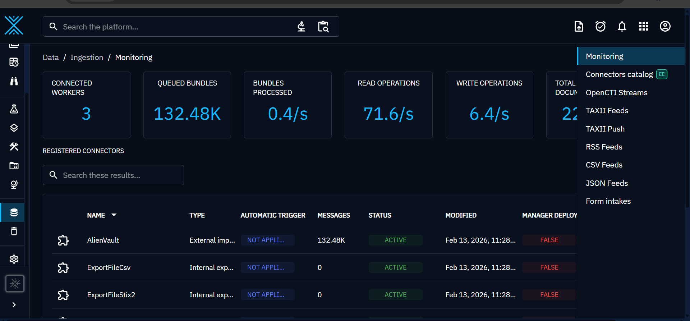

# opencti-soc-lab
Mini SOC lab using OpenCTI (Docker, VirtualBox, Linux)

# OpenCTI SOC Lab (VirtualBox + AlienVault OTX)

This project documents my hands-on lab for building a mini SOC Cyber Threat Intelligence (CTI) environment using OpenCTI on a virtual machine (Oracle VirtualBox) with AlienVault OTX threat feeds integration.

## Environment
- OS: Ubuntu Server (VM on Oracle VirtualBox)
- Platform: OpenCTI
- Containerization: Docker & Docker Compose
- Threat Feeds: AlienVault OTX (Pulse)
- Network: Bridged Adapter

## What I Did
- Deployed OpenCTI using Docker Compose  
- Configured environment variables (.env)  
- Configured VM network (bridge adapter)  
- Integrated AlienVault OTX (Pulse) connector  
- Ingested real-world threat intelligence feeds (IOCs, pulses)  
- Troubleshot login issues, unhealthy containers, and port conflicts  
- Verified OpenCTI dashboard access

## Threat Feeds
- **AlienVault OTX (Pulse)** — Active connector ingesting real-world threat intelligence (IOCs, pulses).  
  _Example: 132k+ messages processed during lab operation._

## Screenshots

**OpenCTI Dashboard**

**OpenCTI Dashboard** – Shows initial dashboard view after setup.

**Docker Containers Status**

**Docker Containers Status** – All core containers healthy & running. 

**AlienVault OTX Connector (Active)**

**AlienVault OTX Connector** – Active ingestion of threat intelligence (132k+ msgs).

> Note: Sensitive information (IP, credentials, API keys) has been removed or blurred.

## Legal & Ethical Note
This lab is for educational purposes only. No unauthorized monitoring or data collection is performed. Always obtain explicit permission and follow applicable laws and policies.
